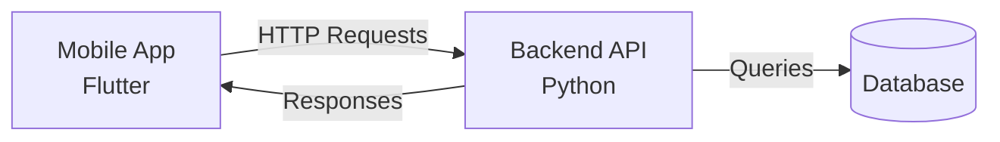

# 🚀 Smart Task Automation App
[](https://www.python.org/)
[](https://dart.dev/)
[](https://flutter.dev/)
[](LICENSE)

A full-stack mobile application designed to automate task management and data processing. This repository is organized as a **Monorepo**, containing both the Python backend services and the Flutter mobile frontend.

---


## 🏗 System Architecture

The project consists of two main components communicating via RESTful APIs:

* **📱 Mobile Frontend (Flutter):** A cross-platform mobile app (Android/iOS) that serves as the user interface for task management and data visualization.
* **🐍 Backend (Python):** A robust server application handling business logic, data validation, and database storage (SQLite/MySQL).



---

## 📂 Repository Structure

```text
.
├── README.md            # Project landing page & architecture overview
├── backend/             # Python Backend (API & Logic)
│   ├── main.py          # Application entry point
│   ├── logic.py         # Business logic & data processing
│   ├── schemas.py       # Data validation models
│   ├── requirements.txt # Python dependencies
│   └── README.md        # Backend setup guide
└── mobile/              # Flutter Frontend (Mobile App)
    ├── lib/             # Dart source code
    ├── assets/          # Images & Environment config
    ├── pubspec.yaml     # Flutter dependencies
    └── README.md        # Mobile setup guide
```

---

## 🛠 Tech Stack

- **Languages:** Python 3.10+, Dart  
- **Frameworks:** Flutter (UI), Pydantic (Validation)  
- **Database:** SQLite / MySQL  
- **Tools:** Git, Pytest  

---

## 🚀 Getting Started

To set up the project locally, you need to configure the **backend** and **mobile app** separately.  
Please follow the detailed guides in their respective folders:

---

### 1️⃣ Set up the Backend

Navigate to the `backend/` directory to install Python dependencies and start the server.

👉 **Read:** [`backend/README.md`](backend/README.md)

### 2️⃣ Set up the Mobile App

Navigate to the `mobile/` directory to install Flutter packages and run the emulator.

👉 **Read:** [`mobile/README.md`](mobile/README.md)

---

## 🔐 Configuration (Environment Variables)

This project uses `.env` files to manage sensitive configuration such as **API keys** and **database URLs**.

- **Backend:**  
  Create a `.env` file in `backend/`  
  See: `backend/.env.example`

- **Mobile:**  
  Create a `.env` file in `mobile/assets/`  
  See: `mobile/README.md`

---


## 👤 Author

[Niranjan Karupothula] (https://github.com/karupothula/) – niranjankarupothula@gmail.com | [LinkedIn](https://www.linkedin.com/in/karupothula/)