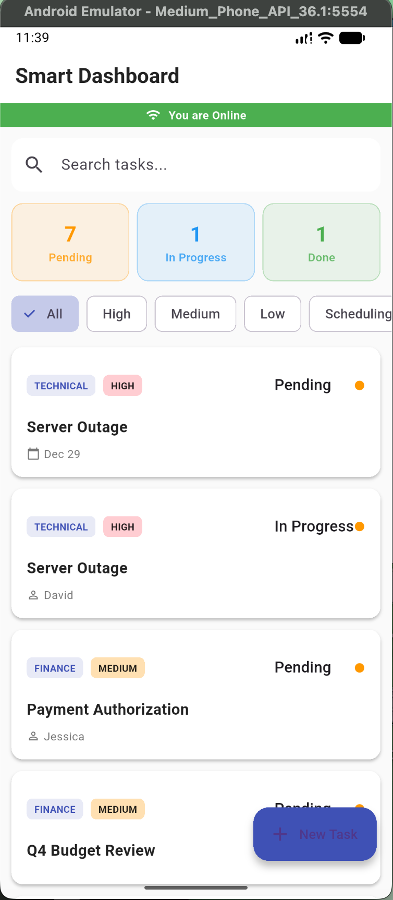
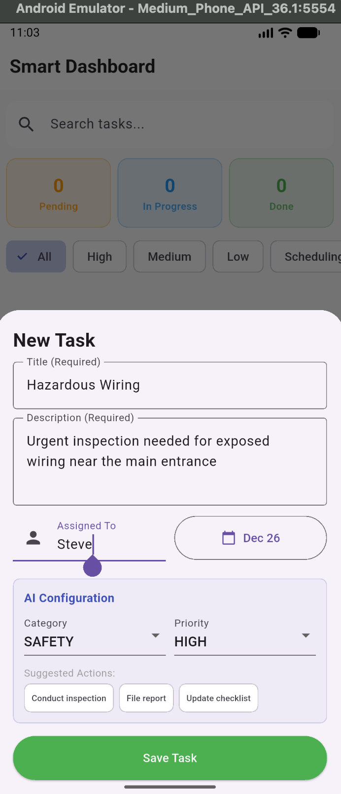
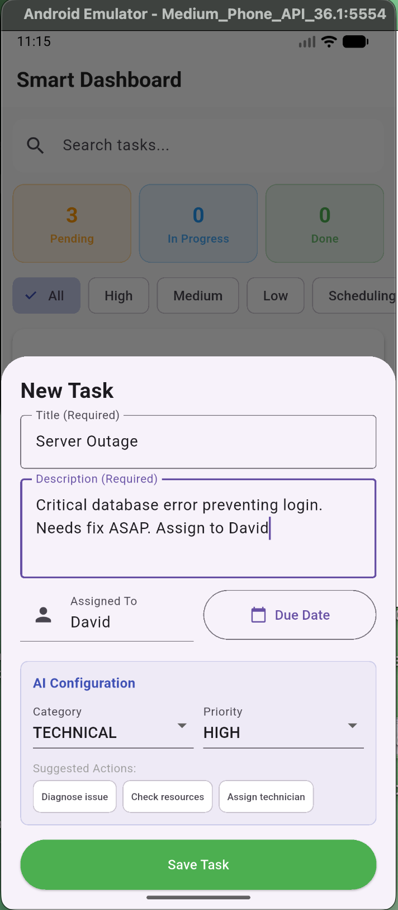
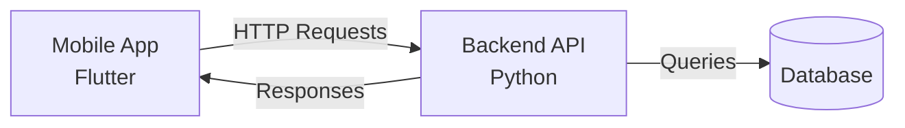

# 🚀 Smart Site Task Manager

[](https://www.python.org/)
[](https://dart.dev/)
[](https://flutter.dev/)
[](LICENSE)

> **Live Backend API:** [https://smbackend-xqvb.onrender.com/docs](https://smbackend-xqvb.onrender.com/docs)  
> **Download Android App:** [Smart-Task-Manager.apk](https://github.com/karupothula/smart-task-backend/releases/download/v1.0.1/Smart-Task-Manager.apk)

---

## 📋 Project Overview
**Smart Site Task Manager** is a full-stack hybrid application designed to automate the classification and prioritization of site operations tasks.

**The Problem:**
Manual task entry in site operations is slow and prone to human error. Workers often mislabel urgency or forget to assign categories.

**The Solution:**
This system utilizes an intelligent **Rule-Based NLP Engine** to analyze task descriptions in real-time without relying on expensive external AI APIs. 

**Key Features:**
* **Auto-Classification:** Detects categories (e.g., "Safety", "Finance") from keywords.
* **Smart Prioritization:** Assigns "High" or "Urgent" priority based on context.
* **Entity Extraction:** Automatically identifies people and dates from text.
* **Action Suggestions:** Generates actionable steps (e.g., "Conduct inspection") based on the category.

---

## 📱 Application Screenshots

### 1. Task Dashboard
*(Real-time status filtering & priority badges)* 

### 2. Smart Creation Form
*(User input with date picker and validation)* 

### 3. Auto-Classification Logic
*(AI detects Category & Priority instantly)* 

---

## 🛠 Tech Stack

### **Mobile Frontend**
* **Technology:** Flutter (Dart)
* **Why:** Cross-platform support, clean Material 3 UI, and robust offline capabilities using `connectivity_plus`.

### **Backend API**
* **Technology:** Python (FastAPI)
* **Why:** Chosen for its speed and superior text-processing (NLP) capabilities compared to Node.js.

### **Database**
* **Technology:** Supabase (PostgreSQL)
* **Why:** Relational data integrity with specific tables for `tasks` and `task_history`.

### **Validation**
* **Technology:** Pydantic
* **Why:** Strict data validation ensuring data consistency before it reaches the database.

### **Deployment**
* **Technology:** Render.com
* **Why:** Live hosting with continuous deployment.

---

## 🏗 System Architecture & Logic

The project follows a **Monorepo** structure to keep the Backend and Mobile logic synchronized in one repository.



### **The Intelligence Engine (Auto-Classification)**

Instead of using slow and costly LLMs (like GPT-4), the backend uses a deterministic **Keyword-Weighted Waterfall** algorithm:

1.  **Normalization:** Text is cleaned and converted to lowercase.
2.  **Category Mapping:**
    * `hazard`, `inspection`, `ppe` → **Safety**
    * `invoice`, `budget`, `cost` → **Finance**
    * `bug`, `server`, `error` → **Technical**
3.  **Priority Scoring:**
    * `urgent`, `asap`, `critical` → **High Priority**
    * `tomorrow`, `week` → **Medium Priority**
4.  **Entity Regex:** Extracts capitalized names following patterns like "assign to" or "with".

---

## ⚙️ Setup Instructions

### **1. Clone the Repository**
```Bash
git clone https://github.com/karupothula/smart-task-manager.git
cd smart-task-manager
```

---

## 2. Backend Setup (Python)
```Bash
cd backend
# Create virtual environment
python -m venv venv
source venv/bin/activate  # On Windows: venv\Scripts\activate

# Install dependencies
pip install -r requirements.txt

# Configure Environment
# Create a .env file in backend/ with:
# SUPABASE_URL=your_supabase_url
# SUPABASE_KEY=your_supabase_key

# Run Server
uvicorn main:app --reload
```
```text
The API will be available at http://127.0.0.1:8000
```

---

## 3. Mobile App Setup (Flutter)
```Bash
cd mobile
# Install dependencies
flutter pub get

# Configure Environment
# Create mobile/assets/.env with:
# API_BASE_URL=[http://10.0.2.2:8000/api](http://10.0.2.2:8000/api)  (For Android Emulator)

# Run on Emulator
flutter run
```

---

## 📡 API Documentation

**Base URL**: https://smbackend-xqvb.onrender.com/api

* **GET** /tasks - List all tasks. (Params: ?limit=10&offset=0)
* **POST** /tasks - Create a new task. (Triggers **Auto-Classification Logic**)
* **GET** /tasks/{id} - Get specific task details.
* **PATCH** /tasks/{id} - Update task status or assignment.
* **DELETE** /tasks/{id} - Permanently remove a task.

## Example: Create Task & Auto-Response

**Request:**
```JSON
POST /api/tasks
{
  "title": "Fix server bug",
  "description": "Urgent database error on production server"
}
```

## Response (System Auto-Generates):
```JSON
{
  "id": "123-abc",
  "category": "technical",
  "priority": "high",
  "suggested_actions": ["Diagnose issue", "Check resources"],
  "status": "pending"
}
```

---

## 🗄 Database Schema

The system relies on two core tables in **Supabase (PostgreSQL)**:

## 1. tasks Table

Primary storage for all task information.
* id (UUID, PK)
* title (Text)
* description (Text)
* category (Text)
* priority (Text)
* status (Text: pending/in_progress/completed)
* extracted_entities (JSONB)

## 2. task_history Table (Audit Log)

Tracks every modification for accountability.
* id (UUID, PK)
* task_id (UUID, FK)
* action (Text: e.g., 'status_change')
* old_value (JSONB)
* new_value (JSONB)
* changed_at (Timestamp)

---

## 🔮 Future Improvements

Given more time, the following features would be prioritized:
* 1. Authentication: Implement Supabase Auth (JWT) to support multi-user teams and secure endpoints.
* 2. Real-Time Sync: Utilize Supabase Realtime subscriptions so updates appear instantly across all connected devices.
* 3. Dark Mode: Extend the Flutter theme to support dark mode for better usability in low-light environments.

---

## 👤 Author

[Niranjan Karupothula] (https://github.com/karupothula/) – niranjankarupothula@gmail.com | [LinkedIn](https://www.linkedin.com/in/karupothula/)